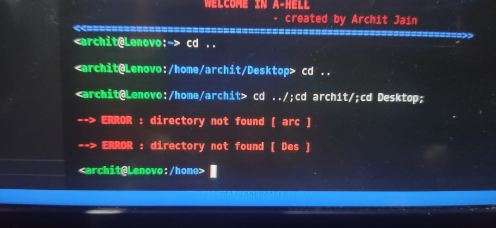

# Archit's Shell (A-Hell)

## How to run
    run following commands in terminal
    ->  make
    -> ./A-Hell

## Features
+ pwd 
+ echo 
+ cd
+ ls
+ pinfo
+ exit
+ foreground commands
+ background commands with exit status
- BONUS COMMANDS
    + history
    + nightswatch
        + interrupt
        + nerborn
- EXTRA COMMANDS
    + to clear the terminal screen by system("cls")
        * syntax -> clear
    + to exit the shell
        * syntax -> exit

## Modular Explaination
+ C files
    + archit.c    : main 
    + prompt.c    : codes for printing prompt
    + cd.c        : codes for cd command
    + echo.c      : codes for echo command
    + pwd.c : codes for pwd command
    + ls.c : codes for ls command
    + pinfo.c : codes for pinfo command
    + cmd.c       : codes for back/foreground command 
    + history.c   : codes for history command 
    + nightwatch.c    :codes for nightswatch command

+ Header file
    + header.h
    + prompt.h
    + cd.h
    + echo.h
    + pwd.h
    + ls.h
    + pinfo.h
    + cmd.h
    + history.h
    + nightswatch.h
+ makefile   

+ README.md  : itself 
* Except all are useless in hell 

## ASSUMPTIONS
+ I have completed all 3 bonus parts 
+ ls cmd has flags -a,-l,-al,-la (another cmd **la < dir >** is made as a alias for ls -la )
+ WARNING status in yellow colour if cmd has extra arguments, then the ouput will be for minimal( default with no flags ) cmd
+ ERROR status in red colour if cmd is facing error with corresponding error 
+ added colours in prompt to deffrentiate it by other
+ added extra msg at starting and exit position

## POSSIBLE ERRORS
+ a warning for using a flag + in %s ignore that
+ printing of prompt twice when q+enter is pressed in nightswatch (one for q+enter and other for next command ig!code)
+ if multiple bg cmd are inserted in one line seprated by ; exit status of only last one will be shown in terminal 
+ their is problem in strtok function it is not working as wanted (don't know why? working fine and submitted 2 days earlier to deadline but found on last day; this was also discussed by two Ta but i can't sort it)
+ they are working fine when one command is entered at a time it is breaking **cd Desktop/** to **cd** and **Desk** or any other subsequence   

      

